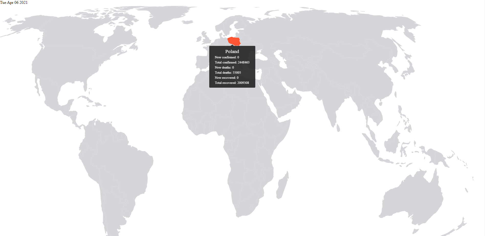

# Covid 19 global statistics

[Global Covid19 statistics](https://cconverter.codrill.eu) is open-source project. Due to present global situation it's
good to know how the virus is spreading and how different countries are dealing with it.

Project was created for learning purposes. 

## Technological Stack

- React
- React Hooks
- TypeScript
- SCSS
- Postman Covid-19 API
- Netlify CI

## Installation

1. Install latest LTS npm (recommended via nvm)
2. Clone repository
3. Perform `npm -i` to install all required dependencies
4. Run project locally using `npm start`